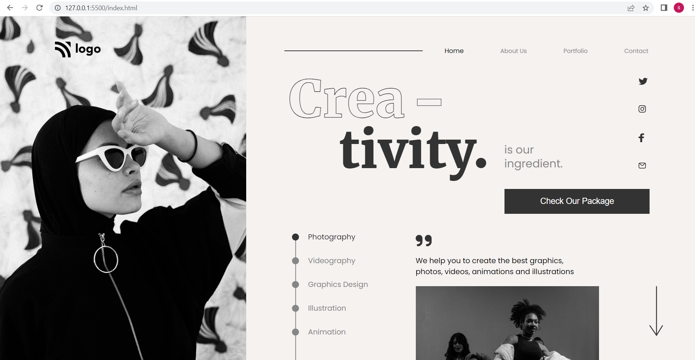

# Project 14

## Project 14 [Live Link]()

-   Skills Gained in this project
    -   Learned about relative & absolute Position.

---

## Time taken to finish this project

-   17 hour .

#### Screenshot

